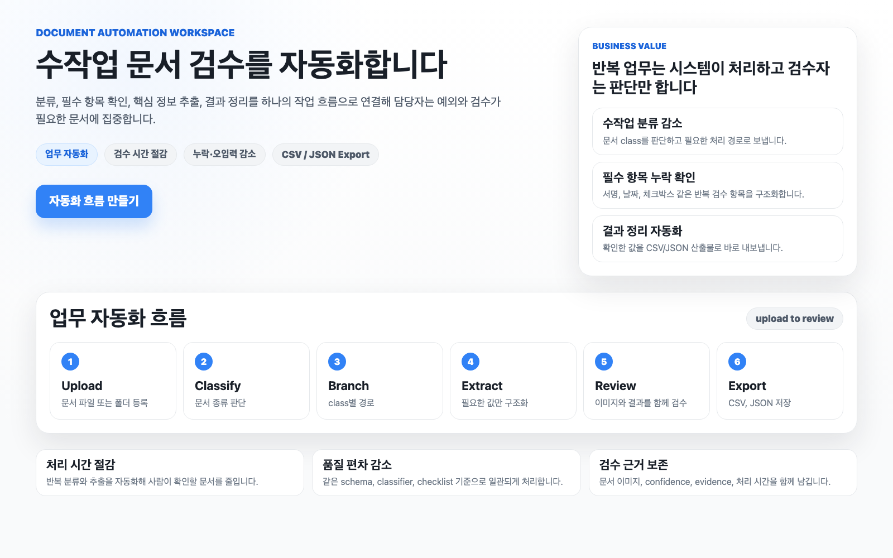
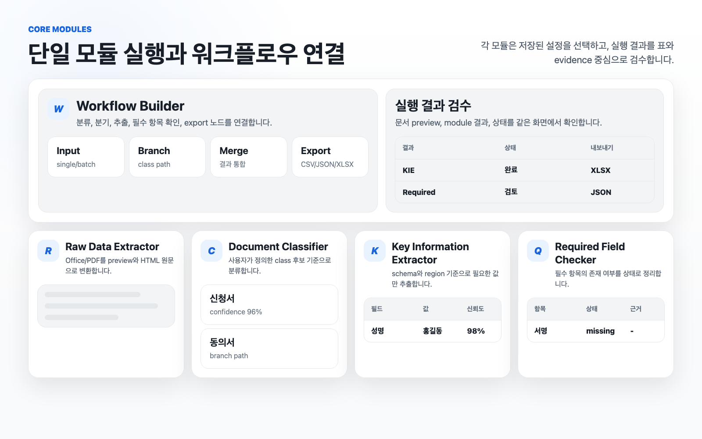
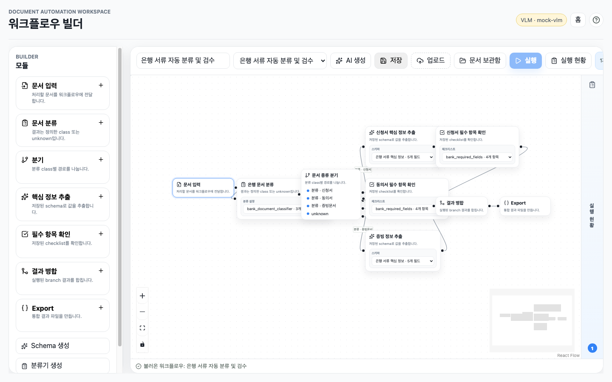
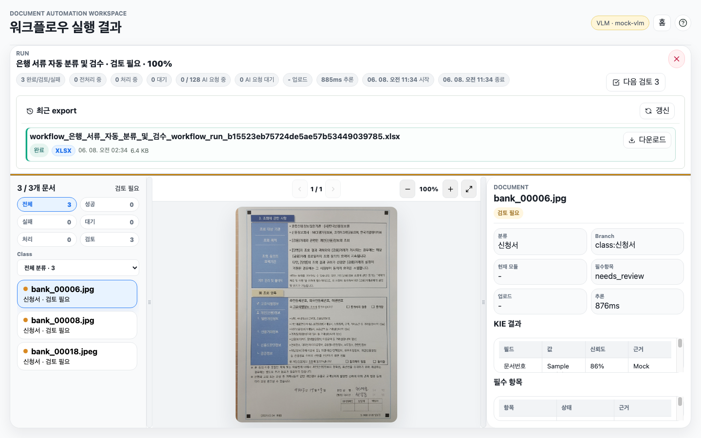

<div align="center">
  <h1>Document Automation Workspace</h1>
  <p><b>수작업으로 반복하던 문서 분류, 필수 항목 확인, 핵심 정보 추출, 결과 정리를 하나의 자동화 흐름으로 연결하는 문서 업무 자동화 앱입니다.</b></p>
  <p>
    <code>Workflow Builder</code>
    <code>Document Library</code>
    <code>Document Classifier</code>
    <code>Required Field Checker</code>
    <code>Key Information Extractor</code>
    <code>Raw Data Extractor</code>
  </p>
</div>



## Demo

### 시연 영상


### 로컬 데모 실행

```bash
uv venv --python 3.11 .venv
uv pip install -e 'backend[dev]'
./scripts/run_dev.sh
```

실행 후 브라우저에서 `http://127.0.0.1:5173/`을 엽니다. 기본 로컬 구성은 `VLM_PROVIDER=mock`으로 외부 AI 호출 없이 UI와 workflow 흐름을 확인할 수 있습니다. 실제 provider를 호출하려면 `.env.example`을 `.env`로 복사한 뒤 `VLM_PROVIDER`, `VLM_API_KEY`, `VLM_MODEL_NAME`을 설정합니다.

## Features

### 단일 모듈 실행과 워크플로우 연결



| Module | Purpose |
| --- | --- |
| Document Library | 파일/폴더를 먼저 보관함에 올리고, 백그라운드 변환 후 모든 모듈과 워크플로우에서 재사용합니다. |
| Workflow Builder | 문서 입력, 분류, 분기, 추출, 필수 항목 확인, 병합, export 노드를 연결합니다. |
| Document Classifier | 사용자가 정의한 class 후보와 `unknown` 기준으로 문서를 분류합니다. |
| Required Field Checker | 성명, 날짜, 서명, 체크박스 등 필수 항목의 존재 여부를 확인합니다. |
| Key Information Extractor | 저장된 schema 기준으로 field, value, confidence, evidence를 추출합니다. |
| Raw Data Extractor | PDF, Office 문서, 이미지의 preview와 원문 데이터를 생성합니다. |

## Document Library

- 홈의 `문서 보관함`에서 파일 또는 폴더를 계속 추가할 수 있습니다.
- 업로드 대기열은 현재 업로드가 진행 중이어도 다음 파일/폴더를 받아 순서대로 처리합니다.
- 보관함은 원본 파일, 상대 경로, 변환 상태, page image/meta를 관리합니다.
- 보관함은 빈 폴더 생성, 전체 선택, 복사, 이동, 잘라내기, 붙여넣기 흐름을 지원합니다.
- 문서/폴더 복사는 원본 payload를 공유하지 않고 새 storage 경로와 새 document id를 만듭니다.
- 선택 삭제는 확인 팝업 후 여러 문서의 원본 payload를 한 번에 삭제합니다.
- 보관함은 목록 보기와 아이콘 보기를 전환할 수 있으며, 문서 영역을 넓게 쓰도록 구성되어 있습니다.
- 보관함에서는 `Command/Ctrl+A/C/X/V`, `Delete`, `Esc` 단축키로 전체 선택, 복사, 이동, 붙여넣기, 선택 삭제, 선택 해제를 실행할 수 있습니다.
- 보관함 작업 진행/완료 상태는 본문을 밀어내지 않고 우측 상단 알림으로 표시됩니다.
- `ready` 문서는 즉시 실행되고, `queued`/`preprocessing` 문서는 준비되면 실행 상태로 모듈/워크플로우 작업에 연결됩니다.
- 문서 삭제는 원본과 page image payload만 삭제하고, 과거 결과 row와 실행 기록은 보존합니다.

## Workflow Builder

### 워크플로우 빌더



### 워크플로우 빌더: 결과 검토



- React Flow 캔버스에서 문서 처리 모듈을 연결합니다.
- `AI 생성`으로 샘플 이미지 최대 10장을 분석해 workflow/schema/checklist 초안을 만들 수 있습니다.
- AI workflow draft 생성은 요청 처리 중 임시 공간만 사용하며, 샘플을 보관함에 저장하는 것은 별도 선택 동작입니다.
- KIE 노드 선택 시 Workflow Builder 안에서 기존 schema field를 수정하거나 새 schema 초안을 만들 수 있으며, 저장/실행 시 schema 초안이 먼저 저장 또는 업데이트된 뒤 workflow에 연결됩니다.
- `업로드`로 새 문서를 보관함에 추가하거나, `문서 보관함`에서 기존 문서를 선택해 실행합니다.
- 새 업로드는 먼저 보관함에 저장되고, workflow run은 보관함 document id를 참조합니다.
- 보관함 문서를 선택하면 업로드를 반복하지 않고 같은 원본 payload를 재사용합니다.
- 새로고침이나 네트워크 끊김 후에는 `이어가기`로 같은 원본을 다시 선택해 남은 항목만 업로드할 수 있습니다.
- 실행 중에는 `추론 일시중단`, `이어하기`, `실행 예약`, `추론 중단`으로 상태를 제어합니다.
- 워크플로우 중단은 보관함 문서를 삭제하지 않고 진행 중인 추론만 멈춥니다. 원본 삭제는 문서 보관함에서만 수행합니다.
- `실행 예약`은 업로드된 원본 문서를 복사하지 않고 다음 workflow run을 `waiting` 상태로 등록하며, 앞선 run이 끝나면 자동으로 시작합니다.
- 진행 상태는 `업로드됨`, `전처리`, `실행 중`, `대기`, `완료/검토/실패` counter로 분리해 표시합니다.
- 결과 화면은 문서 목록 스크롤 위치를 유지하고, 상세 결과에서 문서 이미지와 module output을 함께 검수합니다.
- 결과 CSV/JSON/XLSX에는 문서별 `upload_duration_ms`, `inference_duration_ms`가 포함됩니다.

## Common Ingestion Pipeline

신규 UX의 기본 입력 경로는 문서 보관함입니다. 기존 `init -> items -> start` multipart API는 호환성과 업로드 이어가기를 위해 유지합니다.

| Step | Description |
| --- | --- |
| `library upload` | `/api/library/uploads`가 원본 파일을 저장하고 document conversion job을 등록합니다. |
| `conversion` | 백그라운드 worker가 PDF/page image/meta를 만들고 document를 `ready`로 바꿉니다. |
| `from-documents` | 모듈/워크플로우는 `document_ids`만 받아 batch/run item을 만듭니다. |
| `ready dispatch` | 이미 ready인 문서는 즉시 실행하고, 변환 중인 문서는 준비 후 자동 실행합니다. |
| `summary` | polling은 summary endpoint로 counter만 가져오고, 상세 화면에서만 item page를 조회합니다. |

공통 상태는 `uploading`, `preprocessing`, `waiting`, `running`, `paused`, `completed`, `needs_review`, `completed_with_errors`, `failed`, `canceled`를 사용합니다.

## Public Scope

이 public repository는 문서 자동화 제품 표면에 집중합니다: upload, extraction, classification, validation, workflow building, execution, review, export.

서비스 운영 전용 구현과 정책 문구는 public README에 포함하지 않습니다.

## Project Documents

| Document | Purpose |
| --- | --- |
| [DEVELOPMENT_DEFINITION.md](DEVELOPMENT_DEFINITION.md) | 제품 범위, public feature contract, 핵심 API 그룹, 검증 기준 |
| [DEVELOPMENT_PLAN.md](DEVELOPMENT_PLAN.md) | 현재 focus, 최근 반영 기능, 다음 product task |
| [ERROR_NOTE.md](ERROR_NOTE.md) | 장애/오류 원인, 수정, 재발 방지 기록 |
| [docs/project-insights.md](docs/project-insights.md) | 제품/아키텍처/VLM/워크플로우 설계 인사이트 |
| [docs/templates/bank-documents-poc.json](docs/templates/bank-documents-poc.json) | 은행 서류 데모용 schema/classifier/checklist/workflow template |
| [docs/readme-media.html](docs/readme-media.html) | README 이미지 재생성용 media source |

홈의 `은행 서류 데모 시작` 버튼은 은행 서류용 schema, classifier, checklist, workflow, 샘플 보관 문서 3장을 생성하거나 기존 항목을 재사용한 뒤 seed된 Workflow Builder로 이동합니다. 샘플 출처는 이 저장소의 `assets/sample` 로컬 자산이며, 템플릿 원본은 `docs/templates/bank-documents-poc.json`에 둡니다.

## Input / Output

| Input | Handling |
| --- | --- |
| PDF | page image로 rasterize 후 preview와 VLM context에 사용 |
| PNG/JPG/JPEG | 원본은 그대로 보존하고 preview/VLM용 JPEG를 생성 |
| DOCX/PPTX | LibreOffice로 PDF 변환 후 처리 |
| XLSX | sheet HTML과 PDF preview 생성 |

| Output | Format |
| --- | --- |
| KIE | field, value, normalized value, confidence, evidence |
| Classification | class name, confidence, reason, evidence |
| Required Check | item별 present/missing/uncertain/not_applicable |
| Workflow Export | branch별 union-column CSV/JSON/XLSX, upload/inference duration |

## Stack

| Layer | Tech |
| --- | --- |
| Frontend | Vite, React, TypeScript, React Flow |
| Backend | FastAPI, SQLAlchemy, Alembic-compatible lightweight migration |
| Storage | Local filesystem, optional S3-compatible adapter |
| Document Preview | PyMuPDF, LibreOffice headless |
| VLM | Gemini/OpenAI-compatible/mock provider |

## Local Run

Requirements:

- Python 3.11
- Node.js 20+
- LibreOffice for DOCX/PPTX/XLSX conversion

```bash
uv venv --python 3.11 .venv
uv pip install -e 'backend[dev]'

cd frontend
npm ci
cd ..

./scripts/run_dev.sh
```

| Server | URL |
| --- | --- |
| Frontend | `http://127.0.0.1:5173` |
| Backend | `http://127.0.0.1:8000` |

Mock VLM으로 UI와 workflow만 확인할 때:

```env
VLM_PROVIDER=mock
VLM_MODEL_NAME=mock-vlm
```

로컬 OpenAI-compatible VLM으로 실제 추론할 때:

```env
VLM_PROVIDER=auto
VLM_MODEL_NAME=google/gemma-4-26b-a4b
VLM_BASE_URL=http://127.0.0.1:1234/v1
VLM_API_KEY=
VLM_INFERENCE_PARAMS='{"reasoning_effort":"off","thinking":"off","temperature":"0","verbosity":"","max_completion_tokens":"","top_p":"","service_tier":""}'
VLM_TIMEOUT_SECONDS=600
KIE_FIELD_GROUP_SIZE=1
```

로컬 26B급 모델은 공식 API보다 응답 시간이 길 수 있습니다. 기본 inference parameter는 reasoning/thinking off이며, KIE 단일 실행 화면은 backend job이 `completed`, `needs_review`, `failed`, `canceled`로 끝날 때까지 계속 polling합니다. provider request 자체의 최대 대기 시간은 `VLM_TIMEOUT_SECONDS`로 조정합니다.

`VLM_BASE_URL`이 설정된 OpenAI-compatible 로컬 서버는 provider별 strict `json_schema` 지원 수준이 다를 수 있습니다. 이 경우 backend는 raw `message.content`를 받아 JSON object를 파싱하고, markdown fence, 앞뒤 설명, 긴 공백 후 단순 brace 누락 같은 응답은 가능한 범위에서 복구합니다. 그래도 `VLM_RESPONSE_INVALID_JSON`이 발생하면 모델이 JSON을 끝까지 생성하지 못한 것이므로 `KIE_FIELD_GROUP_SIZE=1`을 유지하고, `VLM_INFERENCE_PARAMS`의 `max_completion_tokens`를 보수적으로 제한하거나 서버/model을 바꿔 확인합니다.

## Verification

Backend tests:

```bash
cd backend
../.venv/bin/python -m pytest tests
```

Frontend build:

```bash
npm run build --prefix frontend
```

Large mock smoke:

```bash
./.venv/bin/python scripts/run_large_mock_smoke.py --count 1000
```

PoC UI smoke:

```bash
./.venv/bin/python scripts/run_poc_ui_smoke.py
```

Diff whitespace check:

```bash
git diff --check
```

## Key Environment Variables

| Env | Default | Description |
| --- | --- | --- |
| `UPLOAD_CHUNK_FILES` | `10` | frontend가 system status에서 읽는 chunk 파일 수 |
| `PREPROCESS_MAX_WORKERS` | `2` | 문서 전처리 동시성 |
| `WORKFLOW_MAX_WORKERS` | `16` | 문서별 workflow local 작업 동시성 |
| `DOCUMENT_PAGE_MAX_LONG_EDGE` | `3000` | preview/VLM용 JPEG 긴 변 제한 |
| `DOCUMENT_PAGE_JPEG_QUALITY` | `88` | preview/VLM용 JPEG 품질 |
| `VLM_BASE_URL` | `""` | 로컬 또는 사설 OpenAI-compatible VLM endpoint |
| `VLM_INFERENCE_PARAMS` | reasoning/thinking `off` | VLM 추론 파라미터 JSON. `reasoning_effort`, `thinking`, `temperature`, `verbosity`, `max_completion_tokens`, `top_p`, `service_tier`를 설정 |
| `VLM_TIMEOUT_SECONDS` | `120` | provider request 1회 최대 대기 시간. 로컬 대형 모델은 300~900 권장 |
| `VLM_MAX_CONCURRENT_REQUESTS` | `8` | provider로 나가는 AI 동시 요청 수 |
| `KIE_FIELD_GROUP_SIZE` | `2` | KIE 요청 1회에 묶는 field 수. 로컬 VLM은 1로 줄이면 timeout/JSON 실패를 줄일 수 있음 |
| `DATABASE_POOL_SIZE` | `8` | SQLAlchemy DB connection pool 크기 |
| `DATABASE_MAX_OVERFLOW` | `0` | pool 크기를 넘는 임시 connection 허용 수 |
| `DATABASE_POOL_TIMEOUT_SECONDS` | `30` | DB connection 대기 timeout |
| `UPLOAD_MAX_BATCH_FILES` | `10000` | 한 번에 업로드할 수 있는 batch 파일 수 |
| `UPLOAD_RETENTION_HOURS` | `0` | 로컬 기본 문서 보존 시간 |

Workflow local blocking work는 `WORKFLOW_MAX_WORKERS` 크기의 전용 executor 큐로 제한합니다. 대량 문서 실행에서 worker 대기 자체가 Python default threadpool을 점유하지 않도록 하기 위한 구조입니다.

Workflow 화면의 `처리 중`은 workflow item이 모듈 단계에 진입한 문서 수입니다. 실제 provider 동시 호출 수는 별도 KPI인 `AI 요청 중 / AI 요청 한도`, provider 호출 대기는 `AI 요청 대기`로 표시됩니다. async VLM 호출은 `VLM_TIMEOUT_SECONDS` 안에 완료되지 않으면 실패/재시도 경로로 수렴합니다. KIE 단일 실행 화면은 frontend 자체 제한 시간으로 실패 처리하지 않고 backend job 상태를 계속 따라갑니다. 로컬 OpenAI-compatible 서버는 strict structured output 대신 raw JSON fallback 경로를 사용하므로, 응답이 도착했는데 화면이 진행되지 않는다면 backend job의 `error_message`와 `VLM_RESPONSE_INVALID_JSON` 여부를 먼저 확인합니다.

운영에서 5,000장 이상 대량 처리를 자주 실행한다면 SQLite보다 Postgres 사용을 권장합니다.

## Repository

```text
backend/      FastAPI API, document processing, workflow execution
frontend/     React application
scripts/      local run and mock smoke scripts
docs/         template JSON and README media source
assets/       README images and local sample documents
```
